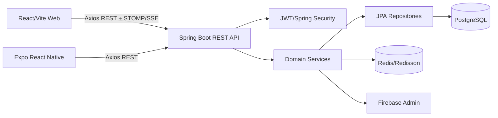

# ShiftSync Project Knowledge

> Tài liệu này được lập từ source code hiện tại. Mỗi kết luận kỹ thuật đều trỏ về package/file tương ứng; khi implementation không đủ để khẳng định, trạng thái được ghi rõ là `[NOT VERIFIED]` hoặc `[INFERRED]`.

## 1. Executive Summary

ShiftSync là nền tảng quản lý lực lượng lao động và xếp ca. Người dùng đăng nhập bằng JWT; nhân viên xem ca, khai báo availability, xin nghỉ, nhận ca mở, chấm công và xem phiếu lương. Quản lý/admin quản lý cửa hàng, nhân sự, skill, demand/headcount, ca, phân công, workforce sharing, attendance và payroll.

Hệ thống có ba client:

* **Backend**: Spring Boot 4.1.1, Java 21, REST API dưới `/api`, JPA/Hibernate, PostgreSQL và Flyway.
* **Web**: React 19 + Vite, React Router, Axios; có workspace 3D/2D cho layout cửa hàng và các trang quản trị.
* **Mobile**: Expo SDK 57, React Native 0.86, React Navigation, Axios và các màn hình staff-first.

Business data nằm ở backend/database. AsyncStorage trên mobile chỉ duy trì token/phiên; không phải nguồn dữ liệu ca, payroll hay profile.

## 2. Repository Structure

| Thư mục | Vai trò |
|---|---|
| `shiftsync-backend/` | Ứng dụng Spring Boot, migration, seed, test và Docker |
| `ShiftSync-Web/` | React/Vite client cho admin/manager và workspace spatial |
| `ShiftSync-Mobile/` | Expo client cho staff và các flow cá nhân |
| `database/` | SQL schema nền ban đầu |
| `docs/` | Tài liệu kiến trúc/nghiệp vụ |
| `API_LIST.md`, `API_Draft.md` | Danh mục endpoint và bản nháp contract |
| `SETUP.md`, `README.md` | Setup và mô tả repository |

Backend entry point là `com.shiftsync.ShiftsyncBackendApplication`. Web entry point là `ShiftSync-Web/src/main.jsx` và `src/App.jsx`. Mobile entry point là `ShiftSync-Mobile/index.js`, `App.js`, `navigation/AppNavigator.js`.

## 3. Technology Stack

### Backend

* Java 21; Spring Boot 4.1.1.
* Spring WebMVC, Validation, Security, Data JPA, Actuator, WebSocket.
* PostgreSQL runtime; Hibernate dialect PostgreSQL.
* Flyway migrations `V1__...` đến `V39__...` trong `src/main/resources/db/migration`.
* Redis/Spring Data Redis và Redisson 3.44.0 cho cache/coordination.
* JJWT 0.12.5 cho access/refresh token.
* SpringDoc OpenAPI 2.8.0; Firebase Admin cho notification; OpenPDF và Apache POI cho export.
* Maven wrapper (`mvnw`, `mvnw.cmd`).

### Web

React 19.2, Vite 8, React Router 7, Axios, Framer Motion, Lucide; Three.js/react-three-fiber và BabylonJS phục vụ spatial workspace; STOMP/SockJS cho realtime.

### Mobile

Expo `~57.0.19`, React Native `0.86.3`, React 19.2, React Navigation native-stack/bottom-tabs, Axios, AsyncStorage, camera/location, Three.js/react-three-fiber.

## 4. System Architecture



Controller nhận request và kiểm tra authenticated principal/role; service thực hiện business rule; repository truy cập entity. `SecurityConfig`, `JwtAuthFilter`, `CustomUserDetailsService` và `StoreAccessService` là ranh giới security/isolation. Web và Mobile không truy cập database trực tiếp.

## 5. Backend Architecture

Package theo bounded domain: `auth`, `store`, `employment`, `skill`, `availability`, `leave`, `shift`, `workforce`, `marketplace`, `attendance`, `payroll`, `quota`, `layout`, `notification`, `request`, `audit`, `shared`.

Pattern chung:

```text
Controller (@...Mapping)
  -> Service (transaction/business rule)
    -> Repository (Spring Data JPA)
      -> Entity/table (PostgreSQL)
```

Các service thuật toán chính: `AutoScheduleService`, `ShiftValidationService`, `ShiftAssignmentService`, `SpatialAllocationService`, `PayrollCalculationService`, `LeaveRequestService`, `WorkforceRequestService`, `MarketplaceService`, `AttendanceService`.

## 6. Web Architecture

`src/App.jsx` cấu hình router/layout. Pages gồm dashboard, employees/detail, stores, schedule, demand planning, attendance, payroll, marketplace, requests, availability, settings, skills, admin và spatial workspace. API được gom trong `src/services/*Service.js` và `src/services/api.js`; page đọc service rồi quản lý loading/error/local form state. `MainLayout`, `Sidebar`, `Header`, `ToastContext` cung cấp shell/UI feedback. Spatial workspace nằm tại `src/features/spatial-workspace` và `src/components/spatial`, nhưng thao tác lưu vẫn đi qua layout/shift APIs.

## 7. Mobile Architecture

`AppNavigator` kiểm tra `accessToken`/`refreshToken` trong AsyncStorage, thử `/api/auth/refresh`, sau đó vào `MainTabs`. Main tabs hiện gồm Dashboard, Schedule, Attendance, Payroll, Request; stack bổ sung Availability, Profile, Marketplace và ApiTestHub.

Screen gọi service trong `services/` (ví dụ `shiftService`, `attendanceService`, `payrollService`, `profileService`), service dùng Axios client tại `services/api.js`. UI không tạo schedule/payroll cục bộ. `ProfileScreenApi` lấy `/api/users/me`; `ScheduleScreen` lấy `/api/users/me/shifts`; `PayrollScreen` lấy `/api/users/me/payslips`.

## 8. Domain Model

* **User/Employment**: `User`, `Employment`, `ContractType`; user có role và quan hệ employment/store.
* **Store/Spatial**: `Store`, `StoreConfiguration`, `StoreTemplate`, `StoreLayout`, `StoreZone`, `Workstation`.
* **Skill**: `Skill`, `SkillLevel`, `StaffSkill`, `ShiftSkillRequirement`.
* **Availability/Leave**: `Availability`, `BlackoutDate`, `LeaveType` (DTO/service), `LeaveRequest`, `LeaveBalance`.
* **Scheduling**: `ShiftTemplate`, `Shift`, `ShiftAssignment`, `ShiftSwapRequest`.
* **Workforce/Marketplace**: `WorkforceRequest`, `WorkforceProposal`, marketplace state is represented through open/published shifts and claims.
* **Attendance/Payroll**: `Attendance`, `AttendanceAdjustmentRequest`, `PayrollPeriod`, `Payroll`, `Holiday`.
* **Notifications/Audit**: `Notification`, `NotificationPreference`, `UserDeviceToken`, `AuditLog`.

The exact FK/unique/index definitions are authoritative in Flyway migrations. Entity Java annotations and migrations must be read together; where they diverge, see `docs/03-database-erd.md`.

## 9. Database Model

Flyway is enabled (`spring.flyway.locations=classpath:db/migration`) and Hibernate schema generation is disabled (`ddl-auto=none`). The migration series adds base users/stores/shifts, skill and availability tables, leave, workforce, spatial layout, attendance, payroll, notification and scheduler hardening. `V34__unique_shift_scheduling_identity.sql` protects scheduling identity; `V37` adds leave balance; `V38` adds leave types; `V39` persists position norm overrides.

## 10. API Reference

The complete route inventory is in `docs/04-api-reference.md`. Controllers are the source for method/path; DTOs and validation annotations define payloads. Swagger is exposed by SpringDoc for `/api/**`.

## 11. Authentication & Authorization

`AuthController` owns register/login/refresh/logout. Access token is parsed by `JwtAuthFilter`; `CustomUserDetailsService` resolves the user. `SecurityConfig` declares public auth/docs paths and protects `/api/**`. Controllers/services additionally enforce role and store access through `StoreAccessService`. Role names used by the implementation are ADMIN, MANAGER and STAFF; exact method-level rules are listed in `docs/06-authentication-authorization.md`.

## 12. Business Rules

Eligibility for assignment combines active employment, store access, skill/skill expiry, availability/blackout, leave overlap, shift overlap, rest and contract/working-hour limits. Open-shift claims and workforce proposals use separate state machines. Payroll is calculated and persisted by backend services; clients only render returned payslips. Detailed source mapping is in `docs/05-business-rules.md`.

## 13. Auto Scheduling Algorithm

`AutoScheduleService` receives store/date/scheduling request, gathers candidate shifts/staff, filters hard constraints, ranks by configured weights/fairness, mutates assignment state, and returns diagnostics/shortage data. `ShiftValidationService` and repositories provide constraint checks; tests under `shift/service` cover feasibility, correctness, fairness and production hardening. The exact current sequence/pseudocode is documented in `docs/07-auto-scheduling.md`.

## 14. Spatial / 3D Allocation

Backend spatial domain stores layouts, zones and workstations. `SpatialAllocationService` allocates zones for shifts using layout data and requirements; `LayoutController` exposes CRUD and `/shifts/{shiftId}/allocate-zones`. Web renders the same data with 2D/3D components. Spatial visualization itself is not evidence that the scheduler invokes a 3D renderer; the call chain documented in `docs/08-spatial-allocation-3d.md` distinguishes allocation service from visualization.

## 15. Business Flows

The primary flow is `login -> token -> client screen -> domain service -> repository -> database`. Detailed flows for schedule/assignment, marketplace, workforce, leave, attendance, payroll and profile are in `docs/09-business-flows.md`.

## 16. Sequence Flows

Mermaid sequence diagrams for authentication, auto-schedule, marketplace claim, attendance and payroll are in `docs/10-sequence-flows.md`. Diagrams only use controller/service names present in source.

## 17. Testing

Backend tests include service, controller, repository/security, algorithm and integration tests. Scheduler benchmarks/CP-SAT tests are excluded from the default Maven test compilation and enabled by profile `cpsat-benchmark`; this is explicit in `pom.xml`. Web has `npm run lint` and `npm run build`; Mobile package scripts provide Expo start targets but no dedicated automated test script. Coverage limitations are listed in `docs/12-testing.md`.

## 18. Deployment

Backend has `Dockerfile`, `docker-compose.yml`, environment-driven PostgreSQL/Redis settings and Maven wrapper. Web builds to Vite `dist`; Mobile runs through Expo. Secrets are supplied through `.env`/environment variables; the default JWT secret in `application.properties` is development-only.

## 19. Known Limitations

* Runtime integration depends on PostgreSQL/Redis/Firebase configuration.
* CP-SAT benchmark classes require the optional Maven profile and native OR-Tools libraries.
* Mobile has no package-level automated test command.
* Some admin/test controllers are intentionally present for diagnostics; they should not be exposed in an unrestricted production deployment.
* Source-level verification cannot prove production data or external-service availability without a live environment.

## 20. Conflicts / Inconsistencies

The authoritative endpoint inventory is generated from controllers, while older markdown lists may lag. `API_LIST.md`/`API_Draft.md` should be compared against `docs/04-api-reference.md` when a route differs. Entity/migration mismatches are not silently resolved; each unresolved item is marked `[NOT VERIFIED]` in the relevant document.

## 21. Source References

Primary references: `shiftsync-backend/src/main/java`, `src/main/resources/db/migration`, `pom.xml`, `application.properties`, `ShiftSync-Web/src`, `ShiftSync-Mobile/screens`, `services`, `navigation`, plus backend tests. Existing README/markdown are secondary context only.

## 22. Verification Status

Static analysis was performed from repository source and route annotations. Runtime API responses, database contents and external Firebase/Redis availability are `[NOT VERIFIED]` unless a test explicitly covers them. The documentation set is intentionally source-linked and must be regenerated when controllers/entities/migrations change.
