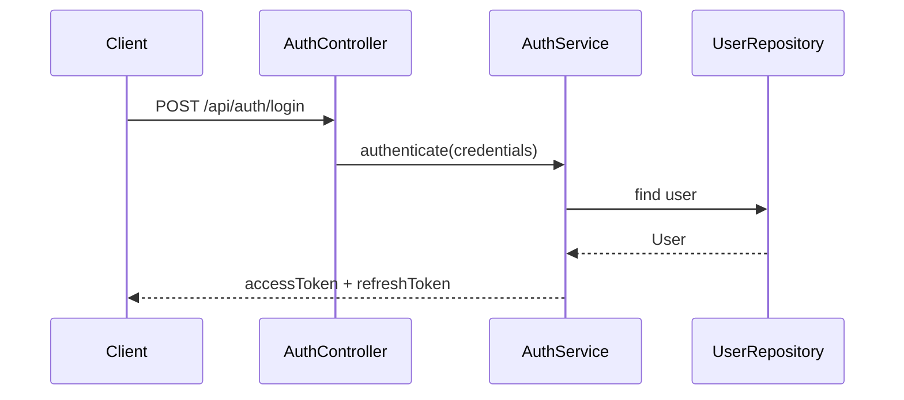
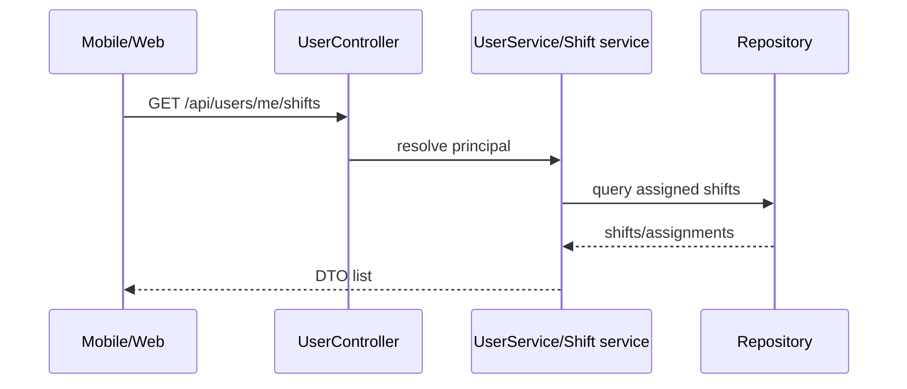
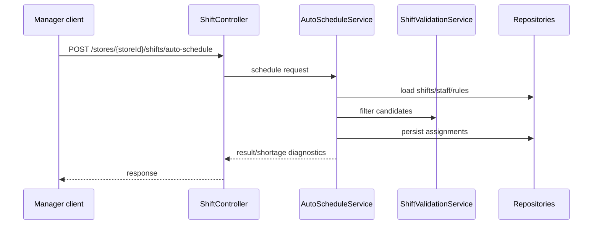
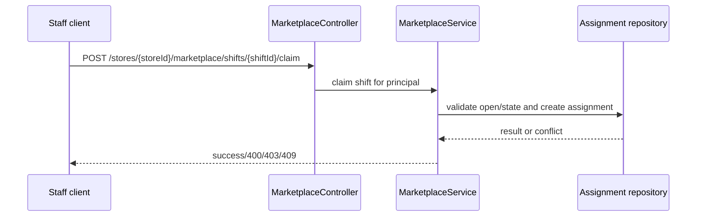

# Sequence Flows

## Authentication

```mermaid
sequenceDiagram
  participant C as Client
  participant A as AuthController
  participant S as AuthService
  participant U as UserRepository
  C->>A: POST /api/auth/login
  A->>S: authenticate(credentials)
  S->>U: find user
  U-->>S: User
  S-->>C: accessToken + refreshToken
```

## Staff schedule

```mermaid
sequenceDiagram
  participant M as Mobile/Web
  participant U as UserController
  participant S as UserService/Shift service
  participant R as Repository
  M->>U: GET /api/users/me/shifts
  U->>S: resolve principal
  S->>R: query assigned shifts
  R-->>S: shifts/assignments
  S-->>M: DTO list
```

## Auto schedule

```mermaid
sequenceDiagram
  participant C as Manager client
  participant SC as ShiftController
  participant AS as AutoScheduleService
  participant V as ShiftValidationService
  participant DB as Repositories
  C->>SC: POST /stores/{storeId}/shifts/auto-schedule
  SC->>AS: schedule request
  AS->>DB: load shifts/staff/rules
  AS->>V: filter candidates
  AS->>DB: persist assignments
  AS-->>SC: result/shortage diagnostics
  SC-->>C: response
```

## Marketplace claim

```mermaid
sequenceDiagram
  participant Staff as Staff client
  participant MC as MarketplaceController
  participant MS as MarketplaceService
  participant DB as Assignment repository
  Staff->>MC: POST /stores/{storeId}/marketplace/shifts/{shiftId}/claim
  MC->>MS: claim shift for principal
  MS->>DB: validate open/state and create assignment
  DB-->>MS: result or conflict
  MS-->>Staff: success/400/403/409
```
