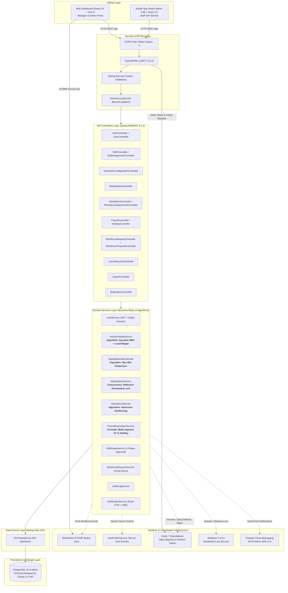

# ShiftSync — System Architecture & Defense Knowledge Map (SYSTEM MAP)

> **Tài liệu phục vụ bảo vệ đồ án tốt nghiệp**  
> **Cam kết độ chính xác:** 100% trích xuất từ source code thực tế (`shiftsync-backend`, `ShiftSync-Web`, `ShiftSync-Mobile`, `db/migration`). Mọi module, service, flow, thuật toán đều có file/class/method đối chứng. Không suy diễn, không bịa đặt.

---

## 1. Project Overview

### 1.1. Project dùng để làm gì?
ShiftSync là **nền tảng điều phối lực lượng lao động thông minh (Smart Workforce Management & Automated Scheduling Platform)** dành cho chuỗi bán lẻ, nhà hàng và chuỗi dịch vụ nhiều chi nhánh. Hệ thống giải quyết các bài toán cốt lõi:
- **Tự động hóa xếp ca làm việc (Automated Shift Scheduling)**: Thay thế việc lập lịch thủ công bằng thuật toán tối ưu hóa heuristic (Dynamic MRV + Local Repair) tuân thủ nghiêm ngặt 5 ràng buộc cứng và cân bằng công bằng tải làm việc.
- **Chia sẻ lực lượng lao động liên chi nhánh (Cross-Store Workforce Sharing)**: Cho phép chi nhánh thiếu nhân lực mượn nhân viên từ chi nhánh lân cận thông qua quy trình đề xuất - phê duyệt 4 bên có kiểm soát.
- **Thị trường nhận ca mở (Shift Marketplace)**: Cho phép nhân viên chủ động nhận các ca làm việc còn trống theo cơ chế cạnh tranh có khóa phân tán (Distributed Lock) chống tranh chấp dữ liệu.
- **Chấm công định vị & mã QR động (Geofenced & QR Attendance)**: Xác thực nhân viên có mặt tại hiện trường thông qua tọa độ GPS (bán kính geofence tính bằng công thức Haversine), mã QR động có chữ ký số (TTL 5 phút) hoặc ảnh selfie trực tiếp.
- **Tính toán tiền lương chuẩn xác (Automated Payroll Calculation)**: Tự động tổng hợp giờ làm việc thực tế, bóc tách giờ chuẩn, giờ làm thêm (OT), giờ làm việc ngày lễ (Holiday Multiplier), bù lương nghỉ phép có lương (Paid Leave) và xuất báo cáo PDF/Excel.
- **Mô hình hóa không gian 3D cửa hàng (3D Spatial Store Layout)**: Trực quan hóa và phân bổ nhân sự vào từng khu vực (Zone) và vị trí làm việc (Workstation) dựa trên giải thuật phân tán cực đại khoảng cách nhỏ nhất (Max-Min Dispersion).

### 1.2. Đối tượng người dùng & Roles
Hệ thống sử dụng enum `SystemRole` ([`com.shiftsync.shared.security.SystemRole`](file:///d:/ThucTapTotNghiep/ShiftSync/shiftsync-backend/src/main/java/com/shiftsync/shared/security/SystemRole.java)) gồm 3 vai trò:

| Role | Định danh trong DB/JWT | Nền tảng sử dụng chính | Quyền hạn và Trách nhiệm |
|---|---|---|---|
| **ADMIN** | `ROLE_ADMIN` | Web Dashboard (`/admin`) | Toàn quyền hệ thống: Quản lý danh sách chi nhánh (Stores), loại hợp đồng (Contract Types), kỹ năng toàn hệ thống, cấu hình định mức nhân sự (Headcount Quota), can thiệp mở khóa kỳ lương đã xác nhận (`CONFIRMED`), xem audit log toàn hệ thống. Bỏ qua kiểm tra Store Isolation. |
| **MANAGER** | `ROLE_MANAGER` | Web Dashboard | Quản trị viên chi nhánh: Quản lý nhân viên thuộc chi nhánh phụ trách, kích hoạt thuật toán tự động xếp ca (`/auto-schedule`), duyệt yêu cầu đổi ca (Swap), phát hành ca mở (Marketplace), yêu cầu/điều động nhân sự mượn liên cửa hàng (Workforce Request), chốt kỳ lương (`DRAFT` → `CONFIRMED` → `PAID`), duyệt đơn xin nghỉ phép. |
| **STAFF** | `ROLE_STAFF` | Mobile App (Expo/React Native) | Nhân viên hiện trường: Khai báo khung giờ rảnh (Availability), ngày bận (Blackout Dates), xem lịch làm việc cá nhân, quét mã QR/chụp ảnh selfie chấm công vào/ra ca, gửi yêu cầu đổi ca cho đồng nghiệp, nhận ca mở trên Marketplace, xin nghỉ phép (Leave Request), xem phiếu lương (Payslip). |

---

## 2. Architecture

### 2.1. Sơ đồ kiến trúc tổng thể (Actual Architecture)



### 2.2. Điểm đặc thù của Kiến trúc thực tế so với mô hình 3-layer cổ điển
1. **Có sự hiện diện của Redis kép (Dual-role Redis)**:
   - `RedisTemplate<String, Object>`: Đóng vai trò In-Memory Session Store để quản lý Refresh Token (TTL 7 ngày) và Blacklist Access Token khi người dùng chủ động Logout.
   - `RedissonClient`: Cung cấp Distributed Lock (`RLock`) giải quyết bài toán đồng thời (Concurrency / Race Condition) khi nhiều nhân viên cùng tranh một ca làm việc trống trên Marketplace.
2. **Kênh phản hồi đa phương thức (Hybrid Realtime Architecture)**:
   - WebSocket STOMP qua `/ws` (kết hợp SockJS) để đồng bộ sự kiện cập nhật lịch và điểm danh theo thời gian thực về Dashboard của Quản lý.
   - Server-Sent Events (SSE) qua `SseEmitterService` cho các thông báo dạng dòng (Streaming).
   - Firebase Cloud Messaging (FCM) thông qua `firebase-admin` để gửi thông báo đẩy (Push Notifications) xuống điện thoại nhân viên khi ứng dụng đóng.
3. **Store Isolation Middleware tích hợp cấp Service**:
   - `StoreAccessService` hoạt động như một bức tường lửa logic: ngăn chặn Manager của cửa hàng A truy xuất hoặc sửa đổi dữ liệu (nhân viên, ca, lịch làm, chấm công, bảng lương) của cửa hàng B, trừ khi tài khoản có quyền `ROLE_ADMIN`.

---

## 3. Repository Map

Cấu trúc mã nguồn được phân bổ như sau:

| Module / Phân hệ | Đường dẫn thư mục | Trách nhiệm kỹ thuật (Responsibility) | Các tệp tin then chốt (Important Files) |
|---|---|---|---|
| **Backend** | `shiftsync-backend/` | Cung cấp RESTful API, thực thi business logic, chạy thuật toán xếp ca, tính lương, bảo mật và kết nối DB. | [`pom.xml`](file:///d:/ThucTapTotNghiep/ShiftSync/shiftsync-backend/pom.xml), [`ShiftsyncBackendApplication.java`](file:///d:/ThucTapTotNghiep/ShiftSync/shiftsync-backend/src/main/java/com/shiftsync/ShiftsyncBackendApplication.java), [`application.properties`](file:///d:/ThucTapTotNghiep/ShiftSync/shiftsync-backend/src/main/resources/application.properties) |
| **Frontend Web** | `ShiftSync-Web/` | Web Single-Page Application (SPA) cho Manager & Admin; trực quan hóa 2D/3D không gian làm việc; quản trị ca kíp. | [`package.json`](file:///d:/ThucTapTotNghiep/ShiftSync/ShiftSync-Web/package.json), [`src/App.jsx`](file:///d:/ThucTapTotNghiep/ShiftSync/ShiftSync-Web/src/App.jsx), [`src/services/api.js`](file:///d:/ThucTapTotNghiep/ShiftSync/ShiftSync-Web/src/services/api.js), [`src/pages/SchedulePage.jsx`](file:///d:/ThucTapTotNghiep/ShiftSync/ShiftSync-Web/src/pages/SchedulePage.jsx) |
| **Mobile App** | `ShiftSync-Mobile/` | Ứng dụng di động Native (Expo/React Native) cho nhân viên phục vụ chấm công Geofence/QR/Selfie, nhận ca, xem lương. | [`package.json`](file:///d:/ThucTapTotNghiep/ShiftSync/ShiftSync-Mobile/package.json), [`navigation/AppNavigator.js`](file:///d:/ThucTapTotNghiep/ShiftSync/ShiftSync-Mobile/navigation/AppNavigator.js), [`services/api.js`](file:///d:/ThucTapTotNghiep/ShiftSync/ShiftSync-Mobile/services/api.js), [`screens/AttendanceScreenLive.js`](file:///d:/ThucTapTotNghiep/ShiftSync/ShiftSync-Mobile/screens/AttendanceScreenLive.js) |
| **Database Migrations** | `shiftsync-backend/src/main/resources/db/migration/` | Quản lý tiến hóa cơ sở dữ liệu qua 37 tệp migration Flyway có thứ tự phiên bản từ V1 đến V40. | [`V1__init_schema.sql`](file:///d:/ThucTapTotNghiep/ShiftSync/shiftsync-backend/src/main/resources/db/migration/V1__init_schema.sql), `V25`, `V29`, `V31`, `V34`, `V37`, `V39`, `V40` |
| **Tests** | `shiftsync-backend/src/test/java/com/shiftsync/` | 380+ kiểm thử tự động bao gồm Unit test, Service test, Controller test, Algorithm correctness test và Benchmark profile. | [`AutoScheduleServiceTest.java`](file:///d:/ThucTapTotNghiep/ShiftSync/shiftsync-backend/src/test/java/com/shiftsync/shift/service/AutoScheduleServiceTest.java), [`ScheduleComparisonBenchmark.java`](file:///d:/ThucTapTotNghiep/ShiftSync/shiftsync-backend/src/test/java/com/shiftsync/shift/service/ScheduleComparisonBenchmark.java), [`CpSatAutoScheduleService.java`](file:///d:/ThucTapTotNghiep/ShiftSync/shiftsync-backend/src/test/java/com/shiftsync/shift/service/CpSatAutoScheduleService.java) |
| **Infrastructure** | Root directory | Cấu hình containerization cho toàn bộ hệ thống gồm DB, Cache, Backend, Web và Mobile. | [`docker-compose.yml`](file:///d:/ThucTapTotNghiep/ShiftSync/docker-compose.yml), `Dockerfile` (Backend, Web, Mobile) |
| **Configuration** | Backend & Client configs | Thiết lập biến môi trường, kết nối Firebase, Spring Security, Jackson, WebSocket, Redisson. | [`SecurityConfig.java`](file:///d:/ThucTapTotNghiep/ShiftSync/shiftsync-backend/src/main/java/com/shiftsync/shared/config/SecurityConfig.java), [`RedisConfig.java`](file:///d:/ThucTapTotNghiep/ShiftSync/shiftsync-backend/src/main/java/com/shiftsync/shared/config/RedisConfig.java), [`WebSocketConfig.java`](file:///d:/ThucTapTotNghiep/ShiftSync/shiftsync-backend/src/main/java/com/shiftsync/config/WebSocketConfig.java) |

---

## 4. Runtime Flow

Quy trình khởi động ứng dụng Backend (`ShiftsyncBackendApplication`) diễn ra chính xác theo các bước thực tế trong mã nguồn:

```text
1. JVM Start & Spring Boot Bootstrap (Spring Boot 4.1.1, Java 21)
   ↓
2. Configuration & Environment Loading
   - Load application.properties
   - Import biến môi trường tùy chọn qua spring-dotenv (optional:file:.env[.properties])
   - Nạp cấu hình multipart (MAX_FILE_SIZE: 10MB phục vụ ảnh chấm công selfie)
   ↓
3. Database Connection & Flyway Migration Execution
   - Khởi tạo DataSource PostgreSQL Driver (org.postgresql.Driver)
   - Flyway được kích hoạt (spring.flyway.enabled=true, baseline-on-migrate=true)
   - Quét classpath:db/migration, kiểm tra bảng flyway_schema_history
   - Thực thi tuần tự các migration chưa áp dụng (V1__init_schema.sql -> V40__add_hourly_rate_to_skill.sql)
   - Hibernate khởi tạo JPA EntityManagerFactory với cấu hình ddl-auto=none (không tự sinh schema)
   ↓
4. In-Memory & Distributed Cache Initialization (Redis & Redisson)
   - Spring Data Redis kết nối tới REDIS_HOST:REDIS_PORT
   - Khởi tạo RedisTemplate<String, Object> với StringRedisSerializer (key) và Jackson JSON (value)
   - RedissonClient tạo kết nối TCP tới redis://host:port (phục vụ RLock phân tán)
   ↓
5. Security & Authentication Infrastructure Setup
   - Khởi tạo BCryptPasswordEncoder Bean
   - Đăng ký DaoAuthenticationProvider với CustomUserDetailsService
   - Cấu hình HttpSecurity: STATELESS session, vô hiệu hóa CSRF, mở CORS với AllowedOriginPatterns ("*")
   - Đăng ký URL công khai: /api/auth/**, /v3/api-docs/**, /swagger-ui/**, /actuator/health, /ws/**
   - Cắm JwtAuthFilter vào trước UsernamePasswordAuthenticationFilter
   ↓
6. Realtime Message Broker & External Integration
   - Khởi tạo WebSocket STOMP Message Broker tại endpoint /ws (hỗ trợ SockJS fallback)
   - Đăng ký ChannelInterceptor trích xuất Bearer JWT từ STOMP CONNECT header
   - Khởi tạo FirebaseApp từ classpath:firebase-service-account.json (nếu tệp cấu hình hợp lệ)
   ↓
7. Component Scanning & Dependency Injection
   - Khởi tạo các Spring Data JPA Repositories (30+ interfaces)
   - Khởi tạo các Service Beans (AutoScheduleService, MarketplaceService, AttendanceService, v.v.)
   - Khởi tạo các REST Controllers (@RestController) quét trong package com.shiftsync
   - SpringDoc OpenAPI quét các endpoint /api/** để dựng Swagger UI
   ↓
8. Server Ready (Port 8080)
   - Nhận các HTTP REST requests và các kết nối WebSocket client từ Web & Mobile.
```

---

## 5. Important Components

| Component / Bean | Tệp mã nguồn | Trách nhiệm chính (Responsibility) | Thành phần sử dụng (Used By) | Các phương thức quan trọng (Important Methods) |
|---|---|---|---|---|
| `AutoScheduleService` | [`AutoScheduleService.java`](file:///d:/ThucTapTotNghiep/ShiftSync/shiftsync-backend/src/main/java/com/shiftsync/shift/service/AutoScheduleService.java) | Thực thi giải thuật tự động xếp ca: sàng lọc 5 ràng buộc cứng, chấm điểm soft score, Dynamic MRV, Local Repair hoán đổi giải cứu ca. | `ShiftController`, `ShiftAssignmentController` | `autoSchedule()`, `attemptLocalRepair()`, `findValidCandidates()`, `calculateScore()` |
| `MarketplaceService` | [`MarketplaceService.java`](file:///d:/ThucTapTotNghiep/ShiftSync/shiftsync-backend/src/main/java/com/shiftsync/marketplace/service/MarketplaceService.java) | Quản lý thị trường ca mở, publish/unpublish ca, nhân viên nhận ca với Redisson Distributed Lock chống race condition. | `MarketplaceController` | `claimOpenShift()`, `publishToMarketplace()`, `getOpenShifts()` |
| `AttendanceService` | [`AttendanceService.java`](file:///d:/ThucTapTotNghiep/ShiftSync/shiftsync-backend/src/main/java/com/shiftsync/attendance/service/AttendanceService.java) | Tạo QR động có chữ ký số (5 phút), kiểm tra Geofence bằng Haversine, xác thực selfie, tính toán trạng thái LATE / EARLY_LEAVE / PRESENT. | `AttendanceController` | `generateQrForShift()`, `scanQr()`, `submitSelfie()`, `validateGeofence()`, `calculateDistance()` |
| `PayrollCalculationService` | [`PayrollCalculationService.java`](file:///d:/ThucTapTotNghiep/ShiftSync/shiftsync-backend/src/main/java/com/shiftsync/payroll/service/PayrollCalculationService.java) | Tính lương định kỳ: phân đoạn theo tuần ISO, tính Overtime (1.5x), Holiday (2.0x/3.0x), bù lương phép có lương, ngăn trả lương 2 lần. | `PayrollController` | `generatePayroll()`, `calculateForEmployee()`, `updatePayrollPeriodStatus()` |
| `SpatialAllocationService` | [`SpatialAllocationService.java`](file:///d:/ThucTapTotNghiep/ShiftSync/shiftsync-backend/src/main/java/com/shiftsync/layout/service/SpatialAllocationService.java) | Phân bổ nhân viên vào khu vực (Zone) và Workstation 3D dựa trên độ tương thích kỹ năng và giải thuật Max-Min Dispersion. | `LayoutController`, `AutoScheduleService` | `allocateZonesForShift()`, `selectBestZoneMaxMinDispersion()` |
| `ShiftSwapService` | [`ShiftSwapService.java`](file:///d:/ThucTapTotNghiep/ShiftSync/shiftsync-backend/src/main/java/com/shiftsync/shift/service/ShiftSwapService.java) | Điều phối quy trình đổi ca 2 bước: nhân viên đích chấp thuận → Quản lý phê duyệt (kiểm tra xung đột ca trước khi hoán đổi). | `ShiftSwapController` | `createSwapRequest()`, `respondToSwapRequest()`, `managerApproveSwapRequest()` |
| `WorkforceRequestService` | [`WorkforceRequestService.java`](file:///d:/ThucTapTotNghiep/ShiftSync/shiftsync-backend/src/main/java/com/shiftsync/workforce/service/WorkforceRequestService.java) | Quản trị quy trình mượn nhân sự liên cửa hàng (Requesting Store ↔ Target Store ↔ Nhân viên được đề xuất). | `WorkforceRequestController`, `WorkforceProposalController` | `createRequest()`, `proposeStaff()`, `respondToProposal()`, `getEligibleStaffForRequest()` |
| `ShiftAssignmentValidator` | [`ShiftAssignmentValidator.java`](file:///d:/ThucTapTotNghiep/ShiftSync/shiftsync-backend/src/main/java/com/shiftsync/shift/service/ShiftAssignmentValidator.java) | Validator tập trung kiểm tra tính hợp lệ của nhân viên khi gán vào ca (kỹ năng, hạn kỹ năng, availability, blackout, nghỉ phép, giờ tuần). | `MarketplaceService`, `ShiftService`, `WorkforceRequestService` | `isEligible()`, `validateEligibility()` |
| `AuthService` | [`AuthService.java`](file:///d:/ThucTapTotNghiep/ShiftSync/shiftsync-backend/src/main/java/com/shiftsync/auth/service/AuthService.java) | Xác thực tài khoản, sinh Access Token & Refresh Token, lưu Redis, cơ chế xoay vòng Refresh Token (Rotation), thu hồi token khi Logout. | `AuthController` | `login()`, `refreshToken()`, `logout()`, `register()` |
| `JwtAuthFilter` | [`JwtAuthFilter.java`](file:///d:/ThucTapTotNghiep/ShiftSync/shiftsync-backend/src/main/java/com/shiftsync/shared/security/JwtAuthFilter.java) | Lọc mọi HTTP request, bóc tách Bearer token, kiểm tra Redis Blacklist, xác thực chữ ký JWT và nạp `CustomUserDetails` vào Context. | `SecurityFilterChain` | `doFilterInternal()` |
| `StoreAccessService` | [`StoreAccessService.java`](file:///d:/ThucTapTotNghiep/ShiftSync/shiftsync-backend/src/main/java/com/shiftsync/shared/security/StoreAccessService.java) | Kiểm soát phân quyền cô lập chi nhánh (Store Isolation): ADMIN truy cập mọi cửa hàng, MANAGER/STAFF phải có hợp đồng ACTIVE tại cửa hàng đó. | Các Controller / Services nghiệp vụ | `canAccessStore()` |
| `NotificationService` | [`NotificationService.java`](file:///d:/ThucTapTotNghiep/ShiftSync/shiftsync-backend/src/main/java/com/shiftsync/notification/service/NotificationService.java) | Gửi thông báo bất đồng bộ (@Async): lưu In-app DB, kiểm tra tùy chọn người dùng (Preference), đẩy FCM Multicast và SSE/WebSocket. | Toàn bộ các domain service | `sendNotification()`, `createInAppNotification()` |

---

## 6. Business Modules

Hệ thống được tổ chức thành 19 module nghiệp vụ độc lập trong package `com.shiftsync.*`:

1. **Authentication & Identity (`auth`)**: Đăng nhập, đăng ký, cấp phát/thu hồi JWT, quản lý phiên qua Redis, cấu hình tài khoản cá nhân.
2. **Store Management (`store`)**: Quản lý chi nhánh, tọa độ địa lý (GPS Lat/Lng), thời gian mở/đóng cửa, cấu hình cửa hàng (`StoreConfiguration`) và tham số lập lịch (`SchedulerConfiguration`).
3. **Employment & Contracts (`employment`)**: Quản lý hợp đồng lao động giữa nhân viên và chi nhánh (`EmploymentStatus`: ACTIVE, TERMINATED), quản lý loại hợp đồng (`ContractType`: Full-Time, Part-Time với `maxWeeklyHours`, `otMultiplier`).
4. **Skill Management (`skill`)**: Danh mục kỹ năng (Barista, Cashier, Kitchen, v.v.), cấp độ kỹ năng (`SkillLevel`: BEGINNER, INTERMEDIATE, ADVANCED, EXPERT), ngày hết hạn chứng chỉ, mức lương theo giờ của vị trí (`hourlyRate`).
5. **Availability & Blackout (`availability`)**: Nhân viên khai báo lịch rảnh hàng tuần theo thứ (`dayOfWeek`, `startTime`, `endTime`) và các ngày bận đột xuất (`BlackoutDate`).
6. **Leave Management (`leave`)**: Đơn xin nghỉ phép (`LeaveRequest`), loại nghỉ phép có lương/không lương (`LeaveType`), hạn mức phép năm (`LeaveBalance` có `@Version` optimistic lock).
7. **Shift & Scheduling Management (`shift`)**: Quản lý ca làm việc (`Shift`), ca mẫu định kỳ (`ShiftTemplate`), yêu cầu kỹ năng và vị trí theo ca (`ShiftSkillRequirement`), phân công ca (`ShiftAssignment`).
8. **Automated Scheduler Engine (`shift.service.AutoScheduleService`)**: Động cơ xếp ca tự động tích hợp thuật toán Dynamic MRV, 5 Hard Constraints, Soft Fairness Cap, Local Repair và tích hợp chẩn đoán thiếu hụt nhân sự (`FeasibilityDiagnosticsDTO`, `ShortageDetailDTO`).
9. **3D Spatial Layout & Workstation Allocation (`layout`)**: Quản lý không gian 3D cửa hàng (`StoreLayout`, `StoreZone`, `Workstation`), thuật toán phân bổ nhân viên vào khu vực 3D (`SpatialAllocationService`).
10. **Shift Marketplace (`marketplace`)**: Thị trường ca làm việc tự do cho phép công khai ca trống (`isOpen = true`) và nhân viên tranh ca dựa trên cơ chế khóa phân tán Redisson.
11. **Shift Swap (`shift.service.ShiftSwapService`)**: Nghiệp vụ hoán đổi ca làm việc giữa 2 nhân viên trong cùng một chi nhánh với quy trình phê duyệt kép và kiểm tra xung đột lịch.
12. **Workforce Sharing (`workforce`)**: Nghiệp vụ mượn - chia sẻ nhân sự liên chi nhánh khi một cửa hàng bị thiếu hụt ca, điều động có sự đồng thuận của nhân viên và 2 quản lý cửa hàng.
13. **Attendance & Time Tracking (`attendance`)**: Điểm danh vào/ra ca thông qua quét QR Token động, kiểm tra Geofence GPS (công thức Haversine), chụp ảnh selfie nhận diện thực tế.
14. **Attendance Adjustment (`attendance.service.AttendanceAdjustmentService`)**: Quy trình nhân viên gửi đơn giải trình/khiếu nại điều chỉnh giờ chấm công khi có sự cố quên chấm công hoặc lỗi GPS.
15. **Payroll Engine (`payroll`)**: Động cơ tính bảng lương định kỳ (`PayrollPeriod`, `Payroll`), tổng hợp giờ làm thực tế, tính lương tăng ca (OT), ngày lễ (`Holiday`), xuất báo cáo PDF/Excel.
16. **Headcount Quota & Demand Planning (`quota`)**: Hoạch định nhu cầu định mức nhân sự tối thiểu theo từng khung giờ trong ngày/tuần, tự động sinh ca nháp (Draft Shifts) từ định mức.
17. **Notification Engine (`notification`)**: Hạ tầng thông báo đẩy Firebase Cloud Messaging (FCM), lưu trữ thông báo trong ứng dụng (In-app), quản lý cấu hình nhận tin theo loại sự kiện (`NotificationPreference`).
18. **Audit Logging (`audit`)**: Ghi vết nhật ký kiểm toán toàn bộ các thao tác nhạy cảm (tạo ca, đổi ca, duyệt phép, chốt lương, cập nhật cấu hình) phục vụ tuân thủ và giải trình.
19. **Dashboard & Analytics (`store.service.DashboardService`)**: Tổng hợp chỉ số vận hành chi nhánh theo thời gian thực: tỷ lệ phủ ca (Coverage Rate), nhân sự vắng mặt, ca làm việc sắp diễn ra, cảnh báo thiếu hụt.

---

## 7. Critical Execution Flows

### Flow 1: Đăng nhập & Xác thực JWT Token (User Authentication)
```text
User (Web/Mobile)
  → POST /api/auth/login {"email": "...", "password": "..."}
  → AuthController.login()
  → AuthService.login()
  → AuthenticationManager.authenticate() -> DaoAuthenticationProvider.authenticate()
      → CustomUserDetailsService.loadUserByUsername() -> UserRepository.findByEmail()
      → BCryptPasswordEncoder.matches()
  → JwtTokenProvider.generateToken() (Access Token, TTL 24h)
  → JwtTokenProvider.generateRefreshToken() (UUID Token)
  → RedisTemplate.opsForValue().set("refresh_token:" + refreshToken, email, Duration.ofDays(7))
  → Trả về AuthResponse { accessToken, refreshToken, user: { id, email, role, ... } }
```
- **Endpoint**: `POST /api/auth/login`
- **Authentication / Authorization**: Public (`permitAll()`).
- **Validation**: `@Valid LoginRequest` (email hợp lệ, password không rỗng).
- **Database / Cache Changes**: Tạo session key trong Redis (`refresh_token:<uuid>`), không đổi DB.

---

### Flow 2: Tự động xếp ca làm việc (Automated Shift Scheduling)
```text
Manager (Web)
  → POST /api/stores/{storeId}/auto-schedule {"startDate": "2026-10-01", "endDate": "2026-10-07"}
  → ShiftController.autoSchedule() / SchedulerConfigurationController
  → StoreAccessService.canAccessStore(auth, storeId) (Kiểm tra quyền truy cập chi nhánh)
  → AutoScheduleService.autoSchedule(storeId, request)
      1. Kiểm tra dải ngày (tối đa 7 ngày / 1 tuần).
      2. Tải SchedulerConfiguration (validate tổng trọng số = 1.000).
      3. Tải danh sách ca DRAFT; xóa bỏ ca ngoài giờ mở/đóng cửa; tự động bù ca từ Headcount Quota nếu trống.
      4. Xóa các phân công cũ có nguồn gốc AUTO (giữ nguyên MANUAL và OPEN_SHIFT).
      5. Bulk fetch toàn bộ dữ liệu nhân viên ACTIVE có SystemRole = STAFF (kỹ năng, availability, blackout, nghỉ phép).
      6. Chuyển đổi các yêu cầu ca thành danh sách Slots.
      7. Dynamic MRV Loop:
         - Tính số lượng ứng viên hợp lệ cho từng slot (lọc qua 5 Hard Constraints).
         - Chọn slot có ít ứng viên nhất (Most Constrained First).
         - Chấm điểm ứng viên (calculateScore) dựa trên trọng số kỹ năng, giờ tuần, công bằng tháng, nghỉ ngơi.
         - Phân công ứng viên điểm cao nhất, cập nhật giờ làm tức thời.
      8. Local Repair: Thử single-swap cho các slot chưa được gán để cứu ca.
      9. Phân bổ không gian 3D (SpatialAllocationService.allocateZonesForShift).
      10. Lưu phân công mới vào DB (ShiftAssignmentRepository.saveAll).
  → Trả về AutoScheduleResult (độ phủ coverageRate, số ca thiếu, chẩn đoán nguyên nhân shortageDetails).
```
- **Endpoint**: `POST /api/stores/{storeId}/auto-schedule`
- **HTTP Method**: `POST`
- **Authentication**: Bearer Token.
- **Authorization**: `@PreAuthorize("hasAnyRole('ADMIN', 'MANAGER')")` + `StoreAccessService.canAccessStore`.
- **Validation**: Khoảng thời gian từ 0 đến 6 ngày (1 tuần), tổng trọng số cấu hình bằng 1.0 ± 0.001.
- **Database Changes**: Xóa các bản ghi `shift_assignment` cũ (`source = 'AUTO'`), thêm mới hàng loạt `shift_assignment`.

---

### Flow 3: Nhân viên nhận ca mở trên Marketplace (Claim Open Shift with Distributed Lock)
```text
Staff (Mobile)
  → POST /api/stores/{storeId}/shifts/{shiftId}/claim
  → MarketplaceController.claimShift()
  → StoreAccessService.canAccessStore(auth, storeId)
  → MarketplaceService.claimOpenShift(storeId, shiftId, staffId)
      1. RLock lock = redissonClient.getLock("shift_claim_lock:" + shiftId);
      2. lock.tryLock(5, 10, TimeUnit.SECONDS) (Chờ tối đa 5s, giữ khóa tối đa 10s).
         - Nếu thất bại: Ném HTTP 429 TOO_MANY_REQUESTS ("Hệ thống đang xử lý, vui lòng thử lại sau").
      3. Bắt đầu Transaction:
         - Kiểm tra ca có đang mở không (shift.isOpen() == true).
         - Kiểm tra hạn đăng ký thời gian (isClaimableByTime).
         - Kiểm tra nhân viên đã được phân công ca này chưa (existsByShiftIdAndStaffId).
         - Kiểm tra số slot còn trống (assignedCount < requiredCount). Nếu hết: ném HTTP 409 CONFLICT ("Ca này đã có người nhanh tay nhận mất!").
         - Kiểm tra điều kiện hợp lệ qua ShiftAssignmentValidator.validateEligibility() (kỹ năng, trùng ca, giờ tuần).
         - Tạo ShiftAssignment mới (source = OPEN_SHIFT).
         - Nếu đủ người, tự động đóng ca trên Marketplace (shift.setOpen(false)).
      4. Cuối cùng trong khối finally: lock.unlock() (giải phóng khóa phân tán).
  → Trả về HTTP 200 OK.
```
- **Endpoint**: `POST /api/stores/{storeId}/shifts/{shiftId}/claim`
- **HTTP Method**: `POST`
- **Authentication**: Bearer Token của Staff.
- **Authorization**: `@PreAuthorize("hasRole('STAFF')")`.
- **Validation**: Đủ kỹ năng, không trùng giờ, không vượt trần giờ hợp đồng, ca chưa đầy slot.
- **Database Changes**: Thêm 1 bản ghi vào bảng `shift_assignment` (`source = 'OPEN_SHIFT'`), cập nhật `shifts.is_open = false` nếu hết chỗ.

---

### Flow 4: Điểm danh vào ca bằng Quét mã QR hoặc Chụp ảnh Selfie (Attendance Check-in)
```text
Staff (Mobile)
  → POST /api/attendance/scan-qr {"qrToken": "...", "latitude": 10.7769, "longitude": 106.7009}
     HOẶC POST /api/attendance/selfie (Multipart form data kèm file ảnh và tọa độ GPS)
  → AttendanceController.scanQr() / submitSelfie()
  → AttendanceService.scanQr() / submitSelfie()
      1. Bóc tách shiftId từ QR Token (giải mã JWT token có TTL 5 phút do Quản lý tạo).
      2. Kiểm tra nhân viên có được phân công trong ca này không (ShiftAssignmentRepository.findByShiftIdAndStaffId).
      3. Tải tọa độ cửa hàng từ Store (Latitude, Longitude) và cấu hình StoreConfiguration.
      4. validateGeofence(): Tính khoảng cách Haversine giữa vị trí nhân viên và cửa hàng.
         - Nếu khoảng cách > storeConfig.geofenceRadiusM (ví dụ 100m): Ném BusinessException HTTP 400.
      5. Kiểm tra khung giờ điểm danh (Check-in Window):
         - windowStart = shiftStart - allowedCheckInMinutes
         - windowEnd = shiftStart + allowedCheckInMinutes
         - Nếu ngoài khoảng: ném lỗi HTTP 400 (Quá sớm hoặc Quá muộn).
      6. Đánh giá trạng thái:
         - Nếu now > shiftStart + lateGraceMinutes -> status = LATE
         - Ngược lại -> status = PRESENT
      7. Lưu bản ghi Attendance vào Database (lưu checkInTime, checkInLat, checkInLng, checkInPhoto).
      8. Bắn sự kiện realtime qua WebSocket (realtimeEventPublisher.publishStoreEvent) về Dashboard cửa hàng.
  → Trả về AttendanceDTO.
```
- **Endpoint**: `POST /api/attendance/scan-qr` hoặc `POST /api/attendance/selfie`
- **HTTP Method**: `POST`
- **Authentication**: Bearer Token.
- **Validation**: Mã QR hợp lệ và chưa hết hạn, GPS nằm trong bán kính Geofence, nằm trong khung giờ cho phép.
- **Database Changes**: Tạo bản ghi mới trong bảng `attendance` (hoặc cập nhật `check_out_time` nếu là lần quét thứ hai).

---

### Flow 5: Hoán đổi ca làm việc (Shift Swap Workflow)
```text
Staff A (Mobile)
  → POST /api/shifts/swap-requests {"fromShiftId": "...", "toStaffId": "...", "toShiftId": "..."}
  → ShiftSwapController.createSwapRequest()
  → ShiftSwapService.createSwapRequest()
      - Kiểm tra cả 2 ca thuộc cùng 1 cửa hàng.
      - Kiểm tra không có yêu cầu đổi ca nào đang PENDING cho 2 ca này.
      - Lưu ShiftSwapRequest (status = PENDING, employeeAccepted = false).
      - Gửi thông báo Push FCM tới Staff B.

Staff B (Mobile)
  → PUT /api/shifts/swap-requests/{requestId}/respond {"accept": true}
  → ShiftSwapService.respondToSwapRequest()
      - Cập nhật employeeAccepted = true (chưa hoán đổi ca trên DB).
      - Gửi thông báo tới Manager cửa hàng yêu cầu phê duyệt.

Manager (Web)
  → POST /api/shifts/swap-requests/{requestId}/approve
  → ShiftSwapController.approveSwapRequest()
  → ShiftSwapService.managerApproveSwapRequest()
      - Kiểm tra xung đột: validateNoOverlapAndWeeklyHours cho Staff A với ca mới và Staff B với ca mới.
      - Hoán đổi trường staff của 2 bản ghi ShiftAssignment (gán source = SWAP).
      - Cập nhật ShiftSwapRequest (status = APPROVED, approvedBy = manager).
      - Ghi AuditLog.
      - Bắn thông báo kết quả tới cả 2 nhân viên.
```
- **Endpoint**: `POST /api/shifts/swap-requests/{id}/approve`
- **HTTP Method**: `POST`
- **Authentication**: Bearer Token.
- **Authorization**: `@PreAuthorize("hasAnyRole('ADMIN', 'MANAGER')")`.
- **Database Changes**: Cập nhật `staff_id` chéo trên 2 hàng của bảng `shift_assignment`, cập nhật trạng thái bảng `shift_swap_request`.

---

### Flow 6: Mượn nhân sự liên chi nhánh (Cross-Store Workforce Sharing)
```text
Manager Cửa hàng A (Requesting Store)
  → POST /api/stores/{storeA}/workforce-requests {"targetStoreId": "{storeB}", "shiftId": "..."}
  → WorkforceRequestController.createRequest()
  → WorkforceRequestService.createRequest() -> Lưu WorkforceRequest (PENDING) -> Báo Manager B.

Manager Cửa hàng B (Target Store)
  → POST /api/stores/{storeB}/workforce-requests/{id}/propose {"staffId": "{staffX}"}
  → WorkforceProposalController.proposeStaff()
  → WorkforceRequestService.proposeStaff()
      - Kiểm tra staffX đang ACTIVE tại Cửa hàng B và hợp lệ cho ca của Cửa hàng A.
      - Lưu WorkforceProposal (PENDING) -> Request chuyển sang PROPOSAL_SENT -> Báo Manager A & Staff X.

Staff X (Mobile)
  → POST /api/users/me/workforce-proposals/{proposalId}/respond {"accept": true}
  → WorkforceProposalController.respondToProposal()
  → WorkforceRequestService.respondToProposal()
      - Xác thực lại tính hợp lệ qua ShiftAssignmentValidator.
      - Proposal chuyển sang ACCEPTED; Request chuyển sang COMPLETED.
      - Tự động tạo ShiftAssignment mới tại Cửa hàng A cho Staff X (source = MANUAL).
      - Bắn thông báo hoàn tất cho Quản lý của cả 2 cửa hàng.
```
- **Endpoint**: `POST /api/users/me/workforce-proposals/{id}/respond`
- **Authentication**: Bearer Token của nhân viên được đề xuất.
- **Database Changes**: Cập nhật `workforce_request`, `workforce_proposal`, tạo mới 1 bản ghi `shift_assignment` liên cửa hàng.

---

### Flow 7: Tính toán & Phát hành bảng lương (Payroll Generation)
```text
Manager / Admin (Web)
  → POST /api/stores/{storeId}/payrolls/generate?startDate=2026-09-01&endDate=2026-09-30
  → PayrollController.generatePayroll()
  → PayrollCalculationService.generatePayroll(storeId, startDate, endDate)
      1. Kiểm tra trạng thái kỳ lương cũ (nếu PAID -> chặn; nếu CONFIRMED -> chỉ ADMIN mới được tạo lại).
      2. Xóa các bản ghi payroll cũ của kỳ nếu tính lại (hardDeleteByPayrollPeriodId).
      3. Bulk fetch toàn bộ danh sách ngày lễ (Holiday) trong kỳ kèm hệ số rateMultiplier.
      4. Bulk fetch danh sách nhân viên ACTIVE có role STAFF (Manager không nhận lương theo ca).
      5. Bulk fetch ShiftAssignments, Attendances và Approved Leave Requests trong kỳ.
      6. Lặp qua từng nhân viên -> calculateForEmployee():
         - Xác định mức lương theo giờ (ưu tiên lương vị trí kỹ năng Skill.hourlyRate -> lương hợp đồng Employment.hourlyRate -> mặc định 23.000 VNĐ).
         - Tính giờ nghỉ phép có lương (Paid Leave) đã được duyệt (chống trả lương 2 lần nếu ngày đó vẫn đi làm).
         - Phân nhóm ca làm việc theo tuần ISO để xác định ngưỡng giờ tuần (maxWeeklyHours).
         - Tính phân đoạn: Giờ chuẩn (Base Hours), Giờ tăng ca (OT Hours với hệ số 1.5x), Giờ ngày lễ (Holiday Hours với hệ số 2.0x/3.0x).
         - Nếu có ca xuyên đêm: chia đôi thời lượng tại thời điểm 00:00 của ngày hôm sau.
      7. Lưu danh sách Payroll và cập nhật PayrollPeriod sang DRAFT.
      8. Gửi thông báo in-app & push FCM tới từng nhân viên.
  → Trả về HTTP 200 OK.
```
- **Endpoint**: `POST /api/stores/{storeId}/payrolls/generate`
- **HTTP Method**: `POST`
- **Authentication**: Bearer Token.
- **Authorization**: `@PreAuthorize("hasAnyRole('ADMIN', 'MANAGER')")` + `StoreAccessService.canAccessStore`.
- **Database Changes**: Tạo/cập nhật bảng `payroll_period`, xóa và nạp mới các bản ghi trong bảng `payroll`.

---

## 8. Algorithms & Business Logic

### 8.1. Thuật toán Tự động xếp ca (Auto-Scheduling: Dynamic MRV + Local Repair)
- **Tên thuật toán**: Greedy Dynamic Minimum Remaining Values (MRV) kết hợp Soft Fairness Cap và Local Repair (Single-Swap Hill Climbing).
- **Mục đích**: Tự động gán nhân viên vào toàn bộ các vị trí ca làm việc còn trống trong tuần sao cho thỏa mãn 100% ràng buộc cứng và tối ưu hóa sự công bằng/chất lượng chuyên môn.
- **Tệp mã nguồn**: [`AutoScheduleService.java`](file:///d:/ThucTapTotNghiep/ShiftSync/shiftsync-backend/src/main/java/com/shiftsync/shift/service/AutoScheduleService.java)
- **Phương thức chính**: `autoSchedule()`, `findValidCandidates()`, `calculateScore()`, `attemptLocalRepair()`.
- **Đầu vào (Input)**:
  - `storeId`: UUID cửa hàng.
  - `startDate`, `endDate`: Khoảng thời gian xếp lịch (tối đa 7 ngày).
  - Cấu hình cửa hàng: `minRestHours` (số giờ nghỉ tối thiểu giữa 2 ca).
  - Trọng số lập lịch: `fairnessWeight`, `skillWeight`, `hourWeight`, `restTimeWeight`, `availabilityWeight` (tổng = 1.000).
- **Đầu ra (Output)**: `AutoScheduleResult` chứa danh sách `ShiftAssignment`, tỷ lệ bao phủ `coverageRate`, báo cáo thiếu hụt `shortages`.
- **Các bước thực thi (Steps)**:
  1. *Tiền xử lý*: Lấy các ca `DRAFT`, dọn dẹp ca ngoài giờ mở cửa, xóa các phân công `AUTO` cũ.
  2. *Lọc 5 Ràng buộc cứng (Hard Constraints - HC)*:
     - **HC1 (Skill)**: Nhân viên phải có kỹ năng yêu cầu và chứng chỉ chưa hết hạn (`expirationDate >= shiftDate`).
     - **HC2 (Availability)**: Nhân viên phải có đăng ký khung giờ rảnh bao phủ ca làm việc (cho phép dung sai ±30 phút), không trùng ngày bận (`BlackoutDate`) và không trùng ngày nghỉ phép đã duyệt (`approvedLeaveDates`).
     - **HC3 (No Overlap)**: Không bị trùng giờ với bất kỳ ca làm việc nào khác (xử lý chính xác ca qua đêm bằng `LocalDateTime`).
     - **HC4 (Max Contract Hours)**: Tổng số giờ làm trong tuần ISO (Thứ Hai đến Chủ Nhật) cộng thêm độ dài ca mới không được vượt quá `maxWeeklyHours` của hợp đồng.
     - **HC5 (Minimum Rest Time)**: Khoảng cách giữa thời điểm kết thúc ca trước và bắt đầu ca sau (và ngược lại) phải $\ge minRestHours$ (mặc định 12 giờ).
  3. *Soft Fairness Cap*: Nếu có $> 1$ ứng viên hợp lệ và trung bình giờ tháng của toàn đội $\bar{H}_{month} > 0$, loại bớt các ứng viên có số giờ tháng $> 1.3 \times \bar{H}_{month}$ để chống dồn việc cho người quen.
  4. *Dynamic MRV Selection*: Tại mỗi vòng lặp, tính số lượng ứng viên hợp lệ còn lại cho từng slot chưa gán. Chọn slot có tập ứng viên nhỏ nhất để gán trước (Most Constrained First).
  5. *Chấm điểm Soft Score*:
     $$\text{Score} = w_{skill} \cdot S_{skill} + w_{hour} \cdot S_{hour} + w_{fair} \cdot S_{fair} + w_{rest} \cdot S_{rest} + w_{avail} \cdot S_{avail}$$
     - $S_{skill}$: BEGINNER (0.25), INTERMEDIATE (0.5), ADVANCED (0.75), EXPERT (1.0).
     - $S_{hour} = \max(0, 1 - \frac{\text{WeeklyHours}}{\text{MaxWeeklyHours}})$.
     - $S_{fair} = \max(0, 1 - \frac{\text{MonthlyAssignedHours}}{\text{MaxWeeklyHours} \times 4})$.
     - $S_{rest}$: Tỉ lệ khoảng nghỉ dôi dư so với mức tối thiểu từ 12h đến 24h.
     - $S_{avail}$: Cố định 1.0 (do HC2 đã bảo đảm tính hợp lệ).
  6. *Tie-breaking tất định*: Ưu tiên ứng viên có tỷ lệ sử dụng hợp đồng (`assignedHours / maxWeeklyHours`) thấp hơn (bảo vệ nhân viên Part-time không bị dồn ép giờ so với Full-time).
  7. *Local Repair*: Nếu còn slot chưa gán, thử hoán đổi đơn (single-swap) tối đa 20 lần với các ca đã phân công mà không vi phạm bất kỳ ràng buộc HC nào của cả 2 nhân viên.
- **Độ phức tạp (Complexity)**:
  - Vòng lặp chính: $O(S^2 \cdot N)$ với $S$ là tổng số slot ca, $N$ là số nhân viên.
  - Local Repair: $O(U \times \text{MAX\_ATTEMPTS} \times N)$ với $U$ là số slot chưa phân công được. Thời gian chạy thực tế: $< 300\text{ ms}$ cho quy mô 50 nhân sự / 80 ca tuần.

---

### 8.2. Thuật toán Phân bổ Không gian 3D (3D Spatial Max-Min Dispersion Allocation)
- **Tên thuật toán**: Geometric Max-Min Dispersion Heuristic.
- **Mục đích**: Phân bổ nhân sự vào các khu vực không gian 3D của cửa hàng sao cho vừa đáp ứng vị trí chuyên môn, vừa phân tán đồng đều mật độ nhân sự trong cửa hàng để tránh tụ tập đông cục bộ.
- **Tệp mã nguồn**: [`SpatialAllocationService.java`](file:///d:/ThucTapTotNghiep/ShiftSync/shiftsync-backend/src/main/java/com/shiftsync/layout/service/SpatialAllocationService.java)
- **Phương thức chính**: `allocateZonesForShift()`, `selectBestZoneMaxMinDispersion()`.
- **Công thức khoảng cách Euclid 3 chiều**:
  $$d(Z_i, Z_j) = \sqrt{(x_i - x_j)^2 + (y_i - y_j)^2 + (z_i - z_j)^2}$$
- **Quy tắc chọn khu vực**:
  $$\text{Zone}^* = \arg\max_{Z \in \text{AvailableCandidates}} \left( \min_{S \in \text{SelectedZones}} d(Z, S) \right)$$
  Ưu tiên 1: Khu vực chỉ định rõ trong `ShiftSkillRequirement`.  
  Ưu tiên 2: Khu vực tương đồng ngữ nghĩa kỹ năng (ví dụ kỹ năng "Barista" map vào Zone có chứa từ khóa "barista/counter").  
  Ưu tiên 3 (Fallback): Chọn khu vực có khoảng cách tới các khu vực đã có người lớn nhất (Max-Min Dispersion).

---

### 8.3. Thuật toán Chấm công & Kiểm tra Bán kính Geofence (Haversine Formula)
- **Tên thuật toán**: Haversine Spherical Distance Calculation.
- **Mục đích**: Tính toán khoảng cách cung tròn trên bề mặt Trái Đất giữa tọa độ GPS của thiết bị di động nhân viên và tọa độ tâm của cửa hàng để cho phép hoặc từ chối chấm công.
- **Tệp mã nguồn**: [`AttendanceService.java`](file:///d:/ThucTapTotNghiep/ShiftSync/shiftsync-backend/src/main/java/com/shiftsync/attendance/service/AttendanceService.java)
- **Phương thức**: `calculateDistance(lat1, lon1, lat2, lon2)`
- **Công thức toán học**:
  $$\Delta\phi = \text{radians}(\text{lat}_2 - \text{lat}_1), \quad \Delta\lambda = \text{radians}(\text{lon}_2 - \text{lon}_1)$$
  $$a = \sin^2\left(\frac{\Delta\phi}{2}\right) + \cos(\text{radians}(\text{lat}_1)) \cdot \cos(\text{radians}(\text{lat}_2)) \cdot \sin^2\left(\frac{\Delta\lambda}{2}\right)$$
  $$c = 2 \cdot \text{atan2}(\sqrt{a}, \sqrt{1-a}), \quad d = R \cdot c \quad (R = 6,371,000\text{ m})$$
- **Quy tắc nghiệp vụ**: Nếu $d > \text{geofenceRadiusM}$ (thường cấu hình từ 50m - 100m trong `StoreConfiguration`), hệ thống từ chối chấm công ngay lập tức.

---

### 8.4. Thuật toán Khóa phân tán giải quyết Tranh chấp Ca mở (Redisson Distributed Lock)
- **Mục đích**: Đảm bảo tại một thời điểm chỉ có 1 nhân viên duy nhất được xử lý nhận ca mở (Marketplace Claim), ngăn ngừa tuyệt đối lỗi Overbooking (2 nhân viên nhận cùng 1 slot khi bấm đồng thời).
- **Tệp mã nguồn**: [`MarketplaceService.java`](file:///d:/ThucTapTotNghiep/ShiftSync/shiftsync-backend/src/main/java/com/shiftsync/marketplace/service/MarketplaceService.java)
- **Phương thức**: `claimOpenShift(storeId, shiftId, staffId)`
- **Cơ chế**:
  - Tên khóa Redis: `"shift_claim_lock:" + shiftId`.
  - Cơ chế chờ: `lock.tryLock(5, 10, TimeUnit.SECONDS)` (Chờ tối đa 5 giây để lấy khóa, tự động nhả sau 10 giây nếu server gặp sự cố treo).
  - Toàn bộ việc kiểm tra số lượng và thêm phân công được bọc trong `TransactionTemplate.executeWithoutResult` bên trong phạm vi bảo vệ của khóa.
  - Khối `finally` đảm bảo `if (lock.isHeldByCurrentThread()) lock.unlock()`.

---

## 9. Security Architecture

### 9.1. Xác thực (Authentication) & Quản lý Token
- **Kiến trúc**: Stateless REST API sử dụng JSON Web Token (JJWT 0.12.5).
- **Thuật toán ký**: HMAC-SHA256 với khóa bí mật tối thiểu 32 ký tự (`app.jwt.secret`).
- **Thời hạn hiệu lực**:
  - `Access Token`: Mặc định 24 giờ (`86400000 ms`), mang thông tin User ID, Email, Role.
  - `Refresh Token`: Chuỗi UUID ngẫu nhiên lưu trong Redis (`refresh_token:<token> -> email`) với TTL 7 ngày.
  - `QR Attendance Token`: Token mã hóa JWT mang `shiftId`, thời hạn sống ngắn (5 phút) để chống gian lận chụp ảnh mã QR gửi cho người khác quét hộ.
- **Cơ chế Thu hồi & Xoay vòng Token (Blacklist & Rotation)**:
  - Khi Logout: Access Token hiện tại được đẩy vào Redis với tiền tố `"blacklist:" + jwt` và TTL đúng bằng thời gian còn lại của token. `JwtAuthFilter` kiểm tra key này ở mọi request.
  - Khi Refresh (`/api/auth/refresh`): Refresh Token cũ bị xóa khỏi Redis và một cặp Access Token/Refresh Token mới được sinh ra (Refresh Token Rotation).

### 9.2. Phân quyền (Authorization) & Ranh giới Chi nhánh (Store Isolation)
- **Cấp độ URL**: `SecurityConfig` quy định các đường dẫn mở (`/api/auth/**`, `/swagger-ui/**`, `/ws/**`, `/actuator/health`) và yêu cầu xác thực đối với toàn bộ các đường dẫn `/api/**` còn lại.
- **Cấp độ Phương thức**: Kích hoạt `@EnableMethodSecurity`. Các phương thức nhạy cảm được bảo vệ bằng `@PreAuthorize("hasAnyRole('ADMIN', 'MANAGER')")` hoặc `@PreAuthorize("hasRole('STAFF')")`.
- **Ranh giới cô lập chi nhánh (Store Isolation)**:
  - Triển khai qua [`StoreAccessService.canAccessStore(auth, storeId)`](file:///d:/ThucTapTotNghiep/ShiftSync/shiftsync-backend/src/main/java/com/shiftsync/shared/security/StoreAccessService.java).
  - Logic thực tế:
    - Nếu tài khoản có `system_role == ADMIN` $\rightarrow$ Cho phép truy cập toàn quyền mọi chi nhánh.
    - Nếu là `MANAGER` hoặc `STAFF` $\rightarrow$ Truy vấn `employmentRepository.isStaffInStore(userId, storeId, EmploymentStatus.ACTIVE)`. Nếu nhân viên không có hợp đồng `ACTIVE` tại chi nhánh mục tiêu, yêu cầu bị từ chối ngay với HTTP 403 Forbidden.

### 9.3. Toàn vẹn dữ liệu & Kiểm soát đồng thời (Optimistic Locking & Soft Delete)
- **Optimistic Locking (`@Version`)**:
  - Được cấu hình trực tiếp trên các entity then chốt:
    - `User.java` (bảng `staff`): Cột `version BIGINT` (thêm từ migration `V3`).
    - `Shift.java` (bảng `shifts`): Cột `version BIGINT` (thêm từ migration `V25`).
    - `LeaveBalance.java` (bảng `leave_balances`): Cột `version BIGINT` (thêm từ migration `V37`).
  - Tác dụng: Ngăn chặn hiện tượng Lost Update khi 2 quản lý cùng chỉnh sửa trạng thái của cùng 1 ca làm việc hoặc 1 nhân viên gửi 2 đơn trừ phép đồng thời.
- **Soft Delete (Xóa mềm)**:
  - Entity `User` sử dụng Hibernate annotations:
    - `@SQLDelete(sql = "UPDATE staff SET deleted = true WHERE id = ? and version = ?")`
    - `@SQLRestriction("deleted = false")`
  - Đảm bảo dữ liệu nhân sự lịch sử trong các bảng phân công, điểm danh, tính lương không bị mồ côi (orphaned) khi nhân viên nghỉ việc.

---

## 10. Unknowns & Technical Gaps (Những điểm chưa thể xác thực)

Theo nguyên tắc minh bạch tuyệt đối và không tự suy đoán ngoài mã nguồn:

1. **Hiệu năng chịu tải thực tế trên cơ sở dữ liệu thật (Live Load & Latency Gap)**:
   - Các bài kiểm thử tích hợp yêu cầu PostgreSQL và Redis thực tế (`AuditLogIntegrationTest`, `PerformanceTest`, `ShiftsyncBackendApplicationTests`) hiện đang bị `@Disabled` hoặc skip trong CI/CD mặc định.
   - Chưa có số liệu đo đạc tải thực tế khi có 10.000 nhân viên cùng quét QR chấm công trong cùng 1 phút (chỉ mới kiểm chứng unit test và profiling in-memory).
2. **Xác thực chứng chỉ Firebase Production (FCM Production Binding)**:
   - Tệp `shiftsync-backend/src/main/resources/firebase-service-account.json` tồn tại trong repo nhưng việc kết nối thành công tới dịch vụ Google Cloud Messaging phụ thuộc vào tính hợp lệ của Project ID và mạng thực tế; chưa thể kiểm chứng nếu không có môi trường triển khai sống.
3. **Mức độ sai số phần cứng GPS trên thiết bị vật lý**:
   - Thuật toán Haversine là chuẩn xác về mặt toán học, tuy nhiên sai số phần cứng thực tế (GPS drift trong nhà kín, phản xạ nhà cao tầng) trên các dòng máy Android/iOS giá rẻ chưa thể định lượng chỉ qua mã nguồn.
4. **Cấu hình Reverse Proxy / TLS Termination / Production Orchestration**:
   - Kho mã nguồn chỉ chứa `docker-compose.yml` cho môi trường phát triển (Dev/Test); không có tệp cấu hình Kubernetes (K8s Manifests), Helm Chart hay Nginx SSL reverse proxy cho môi trường Production thực thụ.

---

## TOP 20 THINGS I MUST KNOW FOR DEFENSE

> **20 điểm cốt tử cần nắm vững để trả lời tự tin trước Hội đồng bảo vệ đồ án:**

1. **Kiến trúc tổng thể của hệ thống là gì?**  
   Hệ thống là Monorepo gồm 3 tầng: Backend Spring Boot 4.1.1 (Java 21), Frontend Web React 19 + Vite 8 (dành cho Admin/Manager) và Mobile Expo SDK 57 / React Native 0.86 (dành cho Staff). Cơ sở dữ liệu PostgreSQL 16.4 quản lý bằng Flyway (37 migrations từ V1 đến V40) và Redis 7 phục vụ cache/khóa phân tán.
2. **Thuật toán tự động xếp ca (Auto-Scheduling) hoạt động như thế nào?**  
   Triển khai tại [`AutoScheduleService.java`](file:///d:/ThucTapTotNghiep/ShiftSync/shiftsync-backend/src/main/java/com/shiftsync/shift/service/AutoScheduleService.java), kết hợp kỹ thuật **Greedy Dynamic MRV (Minimum Remaining Values)** để ưu tiên xếp ca khó trước, chấm điểm soft score đa mục tiêu, áp dụng **Soft Fairness Cap (1.3x giờ trung bình tháng)** và giải cứu ca sót bằng **Local Repair (Single-Swap Hill Climbing)**.
3. **5 Ràng buộc cứng (Hard Constraints - HC1 đến HC5) trong xếp ca là gì?**  
   - HC1: Kỹ năng phù hợp và chứng chỉ còn hạn.  
   - HC2: Có đăng ký giờ rảnh bao phủ ca (±30 phút), không trùng ngày bận và ngày nghỉ phép đã duyệt.  
   - HC3: Không trùng giờ ca khác (xử lý đúng ca xuyên đêm bằng `LocalDateTime`).  
   - HC4: Không vượt quá số giờ tối đa trong tuần ISO theo hợp đồng.  
   - HC5: Nghỉ tối thiểu giữa 2 ca liên tiếp $\ge minRestHours$ (mặc định 12 giờ).
4. **Tại sao không dùng Google OR-Tools CP-SAT mà lại dùng Heuristic trong Production?**  
   Dự án đã triển khai cả PoC CP-SAT tại [`CpSatAutoScheduleService.java`](file:///d:/ThucTapTotNghiep/ShiftSync/shiftsync-backend/src/test/java/com/shiftsync/shift/service/CpSatAutoScheduleService.java) và benchmark so sánh tại `ScheduleComparisonBenchmark`. Lý do không dùng CP-SAT trên production là: thư viện Google OR-Tools phụ thuộc vào native binary C++ (`ortools-win32`, `ortools-linux`), dễ gây lỗi `UnsatisfiedLinkError` khi đóng gói Docker đa nền tảng và CI/CD; trong khi thuật toán Heuristic tự viết chạy thuần 100% Java 21, đạt độ phủ 100% trên dữ liệu thực tế và tốc độ phản hồi tính bằng mili-giây.
5. **Cơ chế cân bằng công bằng tải giữa nhân viên Part-time và Full-time là gì?**  
   Thuật toán sử dụng **Contract Utilization Ratio** (`assignedHours / maxWeeklyHours`) để tie-break thay vì dùng tổng số giờ thô. Nhờ đó nhân viên Part-Time (24h/tuần) và Full-Time (48h/tuần) được phân bổ khối lượng công việc tương xứng với cam kết hợp đồng, không bị thiên vị hay dồn ép ca.
6. **Làm thế nào để chống Race Condition khi nhiều nhân viên cùng tranh nhận ca trên Marketplace?**  
   Sử dụng **Redisson Distributed Lock** ([`MarketplaceService.java`](file:///d:/ThucTapTotNghiep/ShiftSync/shiftsync-backend/src/main/java/com/shiftsync/marketplace/service/MarketplaceService.java)): `RLock lock = redissonClient.getLock("shift_claim_lock:" + shiftId);`. Hệ thống khóa mức độ ca trong Redis, kiểm tra tính khả dụng bên trong transaction cô lập, sau đó mới cấp phát ca và tự động đóng ca nếu đã đủ số lượng.
7. **Cơ chế Store Isolation (cô lập chi nhánh) được cài đặt ở đâu?**  
   Cài đặt tập trung tại [`StoreAccessService.java`](file:///d:/ThucTapTotNghiep/ShiftSync/shiftsync-backend/src/main/java/com/shiftsync/shared/security/StoreAccessService.java). Role `ADMIN` được quyền truy cập toàn bộ hệ thống; Role `MANAGER` và `STAFF` bắt buộc phải có bản ghi hợp đồng `ACTIVE` tại cửa hàng thông qua truy vấn `employmentRepository.isStaffInStore()`.
8. **Cơ chế xác thực và thu hồi JWT hoạt động ra sao?**  
   Hệ thống dùng JWT Stateless nhưng kết hợp **Redis In-Memory Session**: Access Token có thời hạn 24 giờ. Khi Logout, token được ghi vào Redis Blacklist (`"blacklist:" + jwt`) với TTL bằng thời gian sống còn lại; `JwtAuthFilter` sẽ từ chối các token nằm trong blacklist này. Refresh Token được lưu trong Redis và xoay vòng (Rotate) mỗi khi gọi `/api/auth/refresh`.
9. **Chấm công Geofencing hoạt động như thế nào và chống gian lận ra sao?**  
   Tọa độ GPS gửi lên được đối soát với vị trí cửa hàng bằng **công thức Haversine** ([`AttendanceService.java`](file:///d:/ThucTapTotNghiep/ShiftSync/shiftsync-backend/src/main/java/com/shiftsync/attendance/service/AttendanceService.java)). Nếu vượt quá bán kính `geofenceRadiusM` sẽ bị từ chối. Mã QR động được mã hóa JWT có thời hạn chỉ 5 phút (hết hạn sẽ vô hiệu). Chấm công selfie lưu trực tiếp ảnh vào DB để đối soát khuôn mặt.
10. **Thuật toán phân bổ không gian 3D cửa hàng (3D Spatial Allocation) là gì?**  
    Triển khai tại [`SpatialAllocationService.java`](file:///d:/ThucTapTotNghiep/ShiftSync/shiftsync-backend/src/main/java/com/shiftsync/layout/service/SpatialAllocationService.java), áp dụng giải thuật **Max-Min Geometric Dispersion** trên tọa độ không gian $(x, y, z)$. Hệ thống ưu tiên gán theo yêu cầu kỹ năng của ca, sau đó tối đa hóa khoảng cách nhỏ nhất giữa các nhân viên để phân tán mật độ vị trí làm việc đồng đều trong cửa hàng.
11. **Bảng lương được tính toán như thế nào?**  
    [`PayrollCalculationService.java`](file:///d:/ThucTapTotNghiep/ShiftSync/shiftsync-backend/src/main/java/com/shiftsync/payroll/service/PayrollCalculationService.java) chia nhỏ giờ làm việc thực tế theo tuần ISO. Giờ vượt trần hợp đồng tuần được tính Overtime (nhân hệ số hợp đồng, mặc định 1.5x). Giờ làm việc trong ngày lễ (`Holiday`) được nhân hệ số lễ (2.0x hoặc 3.0x). Ca làm việc qua đêm được bóc tách chính xác tại mốc 00:00.
12. **Cơ chế chống trả lương trùng (Double Payment Protection) khi nghỉ phép là gì?**  
    Khi nhân viên có đơn nghỉ phép có lương (`Paid Leave`) đã được duyệt: Nếu nhân viên vẫn đi làm ca đó và có dữ liệu chấm công thực tế, hệ thống chỉ trả lương phép cho phần thời gian ca chưa được làm (`unworkedLeaveHours = Math.max(0.0, schedHours - workedHours)`), tuyệt đối không chi trả lương 2 lần cho cùng một khung giờ.
13. **Quy trình Chia sẻ nhân lực liên chi nhánh (Workforce Sharing) diễn ra như thế nào?**  
    Gồm 5 bước có kiểm soát chặt chẽ: (1) Cửa hàng A tạo yêu cầu mượn nhân sự $\rightarrow$ (2) Quản lý cửa hàng B đề xuất nhân viên phù hợp $\rightarrow$ (3) Hệ thống kiểm tra điều kiện hợp lệ của nhân viên $\rightarrow$ (4) Nhân viên nhận thông báo và bấm Đồng ý $\rightarrow$ (5) Hệ thống tự động tạo phân công ca tại Cửa hàng A cho nhân viên đó.
14. **Quy trình Đổi ca (Shift Swap) giữa 2 nhân viên có những chốt chặn an toàn nào?**  
    Quy trình phê duyệt 2 lớp: Nhân viên B phải đồng ý nhận đổi, sau đó Quản lý cửa hàng mới có quyền bấm duyệt. Trước khi hoán đổi trên DB, hệ thống chạy hàm kiểm tra xung đột `validateNoOverlapAndWeeklyHours()` để đảm bảo ca mới không làm cả 2 nhân viên bị trùng giờ hay vượt trần giờ làm trong tuần.
15. **Hệ thống xử lý ca xuyên đêm (Overnight Shift) như thế nào?**  
    Toàn bộ hệ thống không so sánh bằng `LocalTime` đơn thuần mà chuyển đổi sang `LocalDateTime` (kết hợp `shiftDate` và `startTime`/`endTime`). Nếu `endTime.isBefore(startTime)`, hệ thống tự động cộng thêm 1 ngày cho thời điểm kết thúc (`endTime = endTime.plusDays(1)`), đảm bảo các phép kiểm tra giao khoảng thời gian và tính lương hoàn toàn chính xác.
16. **Cơ chế Khóa lạc quan (Optimistic Locking) được áp dụng ở đâu và để làm gì?**  
    Sử dụng annotation `@Version` trên các thực thể `User` (bảng `staff`), `Shift` (bảng `shifts`) và `LeaveBalance` (bảng `leave_balances`). Khi 2 giao dịch cập nhật cùng một bản ghi, giao dịch commit sau sẽ ném `OptimisticLockException`, ngăn ngừa việc ghi đè mất mát dữ liệu (Lost Update).
17. **Dữ liệu trên Mobile được quản lý ra sao? Có lưu dữ liệu ca làm việc offline không?**  
    Không lưu business data offline. `AsyncStorage` trên Mobile chỉ lưu trữ phiên đăng nhập (`accessToken`, `refreshToken`, `userRole`, `userEmail`). Mọi dữ liệu về ca, lịch làm việc, điểm danh và phiếu lương đều lấy trực tiếp từ Backend qua Axios API để đảm bảo tính nhất quán và bảo mật dữ liệu.
18. **Kiến trúc Realtime hoạt động như thế nào?**  
    Hệ thống sử dụng mô hình lai: WebSocket STOMP qua endpoint `/ws` (kết hợp thư viện SockJS) phục vụ cập nhật bảng điều khiển (Dashboard) của Quản lý tức thời; Server-Sent Events (SSE) cho thông báo trình duyệt; Firebase Admin SDK gửi tin nhắn đẩy FCM Multicast tới điện thoại nhân viên kể cả khi tắt ứng dụng.
19. **Chiến lược tiến hóa cơ sở dữ liệu (Database Migration) là gì?**  
    Hệ thống vô hiệu hóa tính năng tự động tạo bảng của Hibernate (`spring.jpa.hibernate.ddl-auto=none`) và sử dụng Flyway để kiểm soát phiên bản cơ sở dữ liệu thông qua 37 tệp SQL (`V1` đến `V40`). Mọi thay đổi schema (thêm cột version, bảng layout 3D, hạn mức quota, lương theo kỹ năng) đều được lưu vết và thực thi tự động khi khởi động.
20. **Audit Log ghi lại những hành động nào?**  
    Toàn bộ các thao tác nghiệp vụ trọng yếu đều được ghi vào bảng `audit_logs` thông qua `AuditLogService.log()`: Tạo/Hủy Workforce Request, Đề xuất nhân sự, Duyệt/Từ chối đổi ca, Cập nhật trạng thái kỳ lương, Phê duyệt nghỉ phép, v.v., lưu kèm dữ liệu trước và sau thay đổi dưới định dạng JSON để phục vụ thanh tra.
